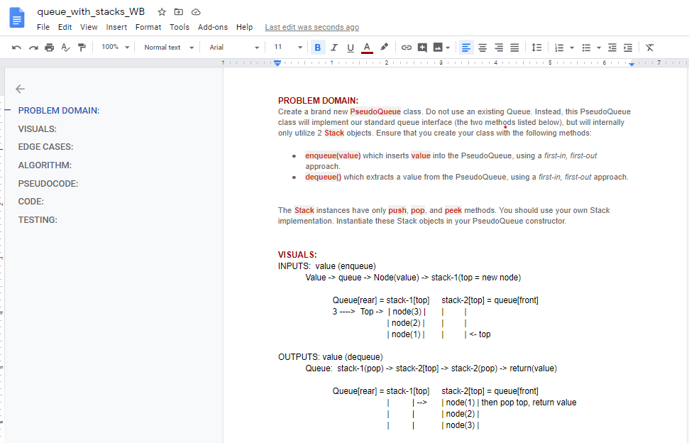
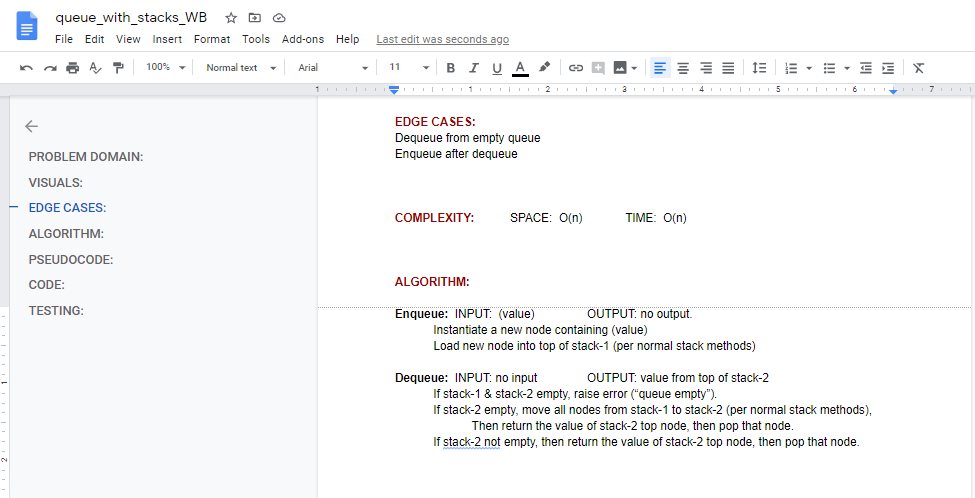
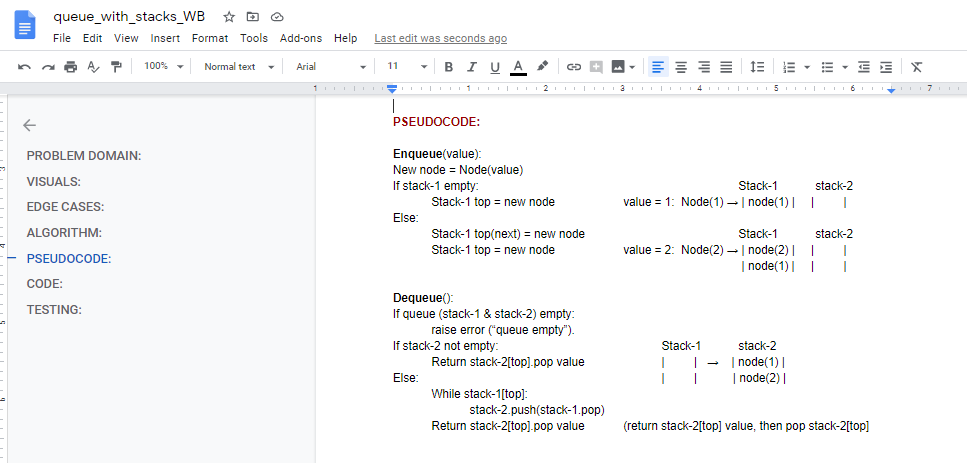
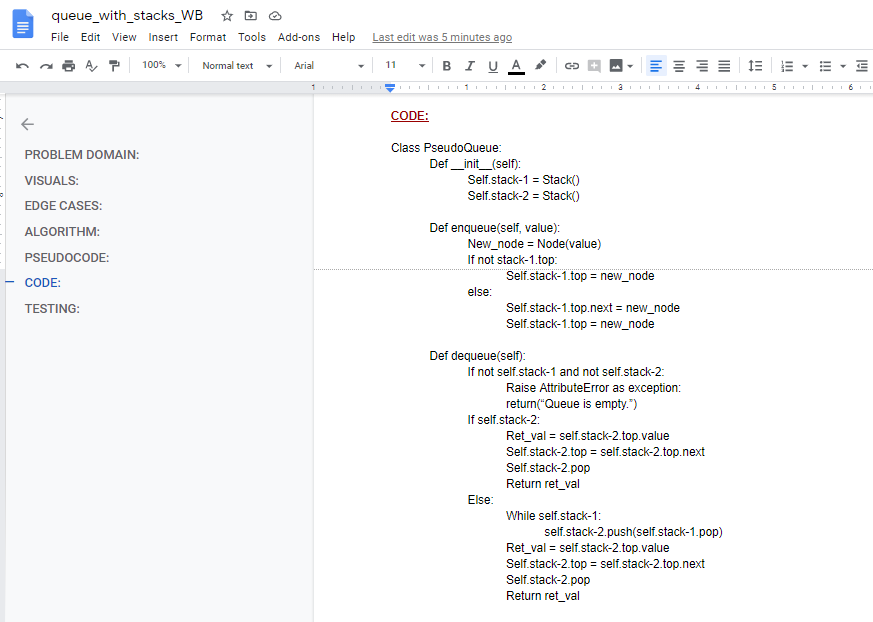
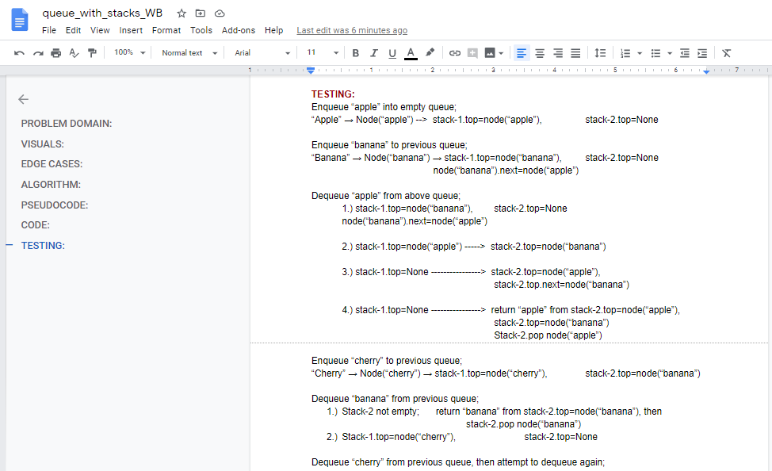
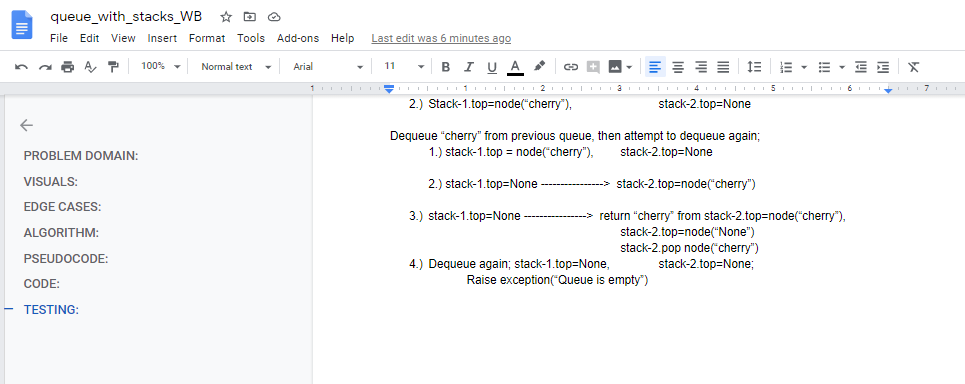

# Queue with Stacks
Implementation of a pseudo-queue class that uses two stack objects internally.

## Challenge
#### Features
Create a brand new __`PseudoQueue`__ class. *Do not use an existing Queue.* Instead, this PseudoQueue class will implement our standard queue interface (the two methods listed below), but will internally only utilize 2 Stack objects. Ensure that you create your class with the following methods:

__`enqueue(value)`__ which inserts value into the PseudoQueue, using a first-in, first-out approach.  
__`dequeue()`__ which extracts a value from the PseudoQueue, using a first-in, first-out approach.  
The __`Stack`__ instances have only __push__, __pop__, and __peek__ methods. You should use your own Stack implementation. Instantiate these Stack objects in your PseudoQueue constructor.

## Approach & Efficiency
Both Stack and Queue were implemented using a singly linked list methodology.  
__Big O space__ for PseudoQueue will be __O(n)__ and  
__Big O time__ for PseudoQueue will be __O(n)__.

## API
This implementation has access to the Node class and all the properties of the Linked List and Stack classes.

## Solution
My code is [here.](./queue_with_stacks.py)

## Code Challenge 11 whiteboards:
#### Queue with Stacks - 

## Task Checklist:  
- [ ] Top-level README “Table of Contents” is updated  
- [ ] Feature tasks for this challenge are completed  
- [ ] Unit tests written and passing  
    - [ ] “Happy Path” - Expected outcome  
    - [ ] Expected failure  
    - [X] Edge Case (if applicable/obvious)  
- [X] README for this challenge is complete  
    - [X] Summary, Description, Approach & Efficiency, Solution  
    - [X] Link to code  
    - [X] Pictures of whiteboards  
